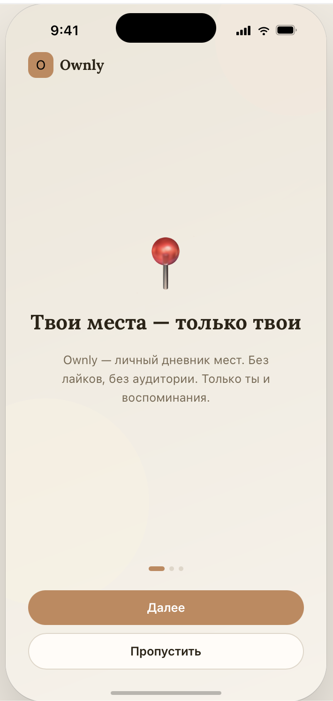
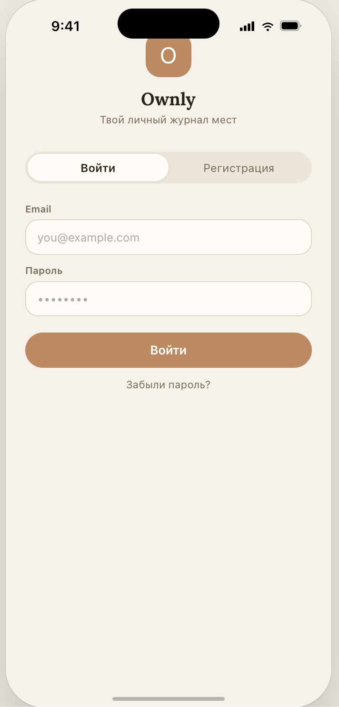
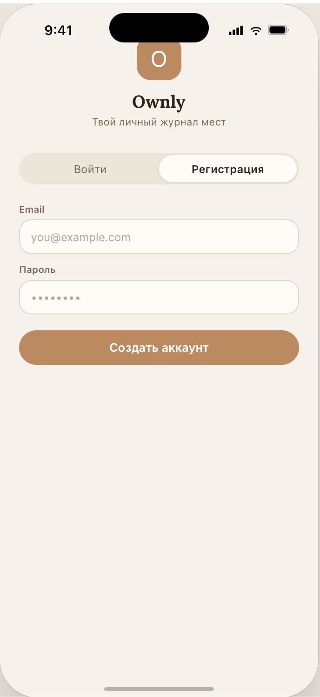
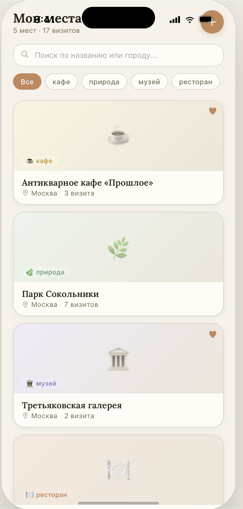
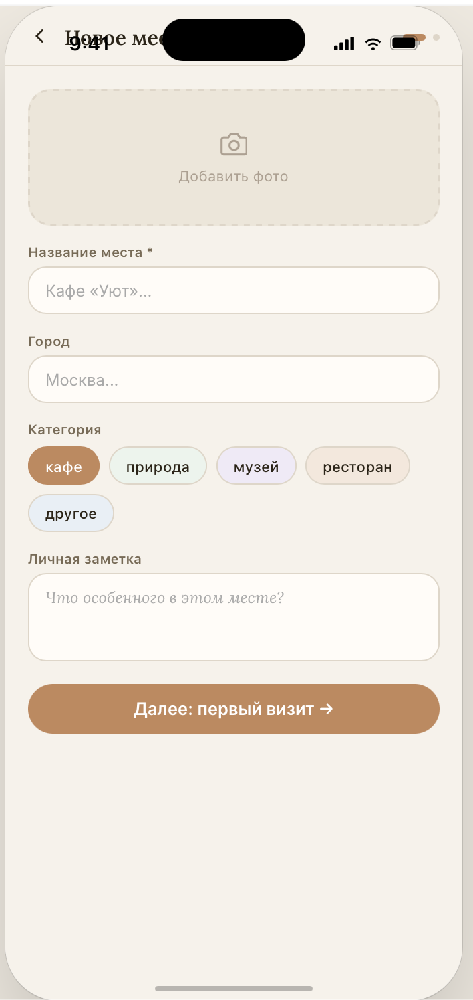
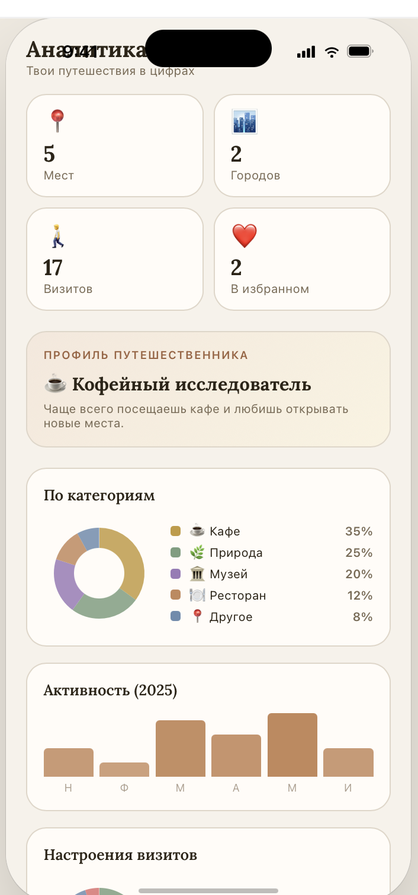
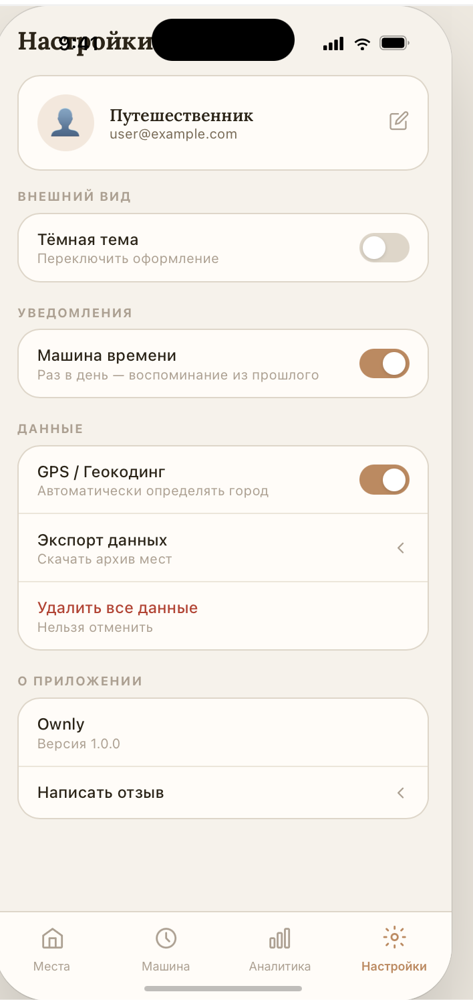

# Ownly

> Личный дневник мест. Не Instagram, не карта — просто личное.

Добавляйте места, фиксируйте атмосферу (настроение, погода, с кем были), оставляйте заметки.
Через год приложение напомнит: «Год назад ты был здесь».

---

## Скриншоты

<table>
  <tr>
    <td align="center"><b>Онбординг</b></td>
    <td align="center"><b>Вход</b></td>
    <td align="center"><b>Регистрация</b></td>
    <td align="center"><b>Главная</b></td>
  </tr>
  <tr>
    <td></td>
    <td></td>
    <td></td>
    <td></td>
  </tr>
  <tr>
    <td align="center"><b>Добавить место</b></td>
    <td align="center"><b>Аналитика</b></td>
    <td align="center"><b>Настройки</b></td>
    <td></td>
  </tr>
  <tr>
    <td></td>
    <td></td>
    <td></td>
    <td></td>
  </tr>
</table>

---

## Возможности

- **Места** — личная коллекция кафе, парков, музеев, ресторанов с фото, описанием и геолокацией
- **Визиты** — каждый визит фиксирует настроение, погоду, компанию и заметку
- **Поиск и фильтры** — мгновенный поиск по названию, фильтрация по категориям
- **Аналитика** — статистика, donut-графики по категориям/настроению, помесячный bar-chart активности
- **Time Machine** — таймлайн «год / месяц / неделю назад» + кнопка «Удиви меня»
- **Избранное** — отметка любимых мест в один тап
- **Экспорт** — выгрузка всех данных в JSON через системный share-sheet
- **Тёмная тема, тогглы уведомлений и GPS** — настройки в iOS-стиле
- **Полностью офлайн** — данные хранятся локально (Hive), интернет не нужен

---

## Стек

| Слой | Технологии |
|------|------------|
| **Framework** | Flutter 3.35 · Dart 3.9 |
| **State management** | Riverpod 2.x |
| **Routing** | go_router (`StatefulShellRoute` для bottom nav) |
| **Локальное хранилище** | Hive |
| **Auth** | Firebase Auth |
| **Графики** | fl_chart |
| **UI** | Material 3 · Google Fonts (Lora + Inter) |
| **Платформенное** | image_picker · image_cropper · geolocator · geocoding · share_plus |

---

## Архитектура

Clean Architecture в три слоя:

```
lib/
├── core/            # Темы, роутер, константы, общие виджеты
├── domain/          # Pure Dart — entities, repositories (abstract), use cases
├── data/            # Hive datasource, models с JSON-сериализацией, repository impls
└── presentation/    # Screens, providers (Riverpod), виджеты
```

- `domain/` не зависит от Flutter — только entities и контракты репозиториев
- `data/` реализует репозитории через Hive
- `presentation/` подключает use cases через Riverpod-провайдеры

Подробная схема директорий — в [`PLAN.md`](./PLAN.md).

---

## Экраны

| Экран | Маршрут | Что внутри |
|-------|---------|-----------|
| Onboarding | `/onboarding` | 3 анимированных слайда |
| Auth | `/auth` | Pill-таб switcher login/register |
| Home | `/` | Сетка мест 2 колонки, поиск, чипы-фильтры, FAB |
| PlaceDetail | `/place/:id` | Hero с градиентом категории, статистика, история визитов |
| AddPlace | `/add-place` | 2 шага — место → настроение/погода/компания |
| Analytics | `/analytics` | Tiles 2×2, donut и bar-charts |
| TimeMachine | `/time-machine` | Таймлайн «год/месяц/неделя назад» |
| Settings | `/settings` | Профиль, тогглы, экспорт, выход |

---

## Модель данных

```dart
Place {
  id, name, description, category: PlaceCategory,
  city, latitude?, longitude?, photoPath?,
  createdAt, isFavorite
}

Visit {
  id, placeId,
  mood: MoodType, weather: WeatherType, companion: CompanionType,
  note?, visitedAt
}

PlaceCategory  { cafe | nature | museum | restaurant | other }
MoodType       { great | good | neutral | bad }
WeatherType    { sunny | cloudy | rainy | snowy }
CompanionType  { alone | friend | couple | family }
```

Хранение: `Hive.box('places')`, `Hive.box('visits')`, `Hive.box('settings')`. Каждая запись — `jsonEncode(entity.toJson())` по ключу `id`.

---

## Дизайн-токены

| Токен | Цвет | Использование |
|-------|------|---------------|
| `bgPrimary` | `#F7F2EA` | Основной фон |
| `bgCard` | `#FFFCF7` | Карточки, инпуты |
| `bgDeep` | `#EDE6D9` | Tab switcher, вторичные фоны |
| `accent` | `#C4875A` | Кнопки, активные состояния, FAB |
| `textPrimary` | `#2C2416` | Заголовки |
| `textSub` | `#7A6A54` | Вторичный текст |
| `textMuted` | `#AFA090` | Placeholders, labels |
| `border` | `#E0D6C8` | Бордеры карточек |

Шрифты: `GoogleFonts.lora()` — заголовки/цитаты, `GoogleFonts.inter()` — UI-лейблы.

---

## Запуск проекта

### Требования

- Flutter SDK ≥ 3.35 (Dart ≥ 3.9.2)
- Android Studio / Xcode для сборки под платформы
- Firebase проект (для auth) — конфиг в `lib/firebase_options.dart`

### Установка

```bash
git clone <repo-url>
cd ownly
flutter pub get
flutter run
```

### Сборка релизного APK

```bash
flutter build apk --release
```

Результат: `build/app/outputs/flutter-apk/app-release.apk` (~53 MB, универсальный).

Сборка с разделением по архитектурам (3 файла, меньше каждый):

```bash
flutter build apk --split-per-abi
```

Получите:
- `app-arm64-v8a-release.apk` — современные устройства (большинство с 2017+)
- `app-armeabi-v7a-release.apk` — старые 32-битные
- `app-x86_64-release.apk` — эмуляторы / редкие устройства

### Сборка под iOS

```bash
flutter build ios --release
```

> ⚠️ Текущая Android-конфигурация подписана debug-ключом (см. `android/app/build.gradle.kts`). Для публикации в Play Store настройте свой `signingConfig` под release.

---

## Структура проекта

```
ownly/
├── lib/                # Исходники приложения
├── android/            # Android-проект (Gradle)
├── ios/                # iOS-проект (Xcode)
├── web/ macos/ linux/ windows/   # Прочие платформы
├── pubspec.yaml        # Зависимости и метаданные
├── firebase.json       # Конфиг Firebase CLI
├── PLAN.md             # Детальная архитектура и план
├── REFACTOR_PLAN.md    # История рефакторинга
└── README.md
```

---

## Лицензия

Личный проект.
